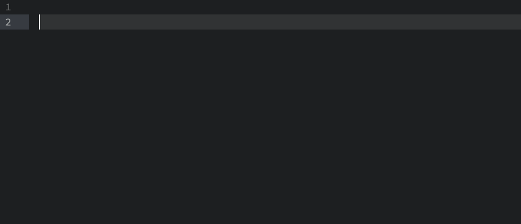

# fake-image snippets for Atom

This is snippets for set `` placeholder with [fakeimg](https://fakeimg.pl/) quickly.

## Install

Search `fake-image-snippets` on package manager or `apm install fake-image-snippets`

## Usage

## Documentation

This snippet tabs through some options (default):

- horizontal size 350
- vertical size 200
- background color bdd9d2
- text color 3f232a
- sample text Fake-Imag

following are other options you can set:

- `font=lobster`
- `font_size=14`
- `retina=1`

More detail you can see [fakeimg](https://fakeimg.pl/)

## Example

``

## Contributing

- Fork it!
- Create your feature branch: `git checkout -b my-new-feature`
- Commit your changes: `git commit -m 'Add some feature'`
- Push to the branch: `git push origin my-new-feature`
- Submit a pull request
